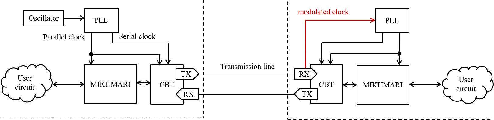
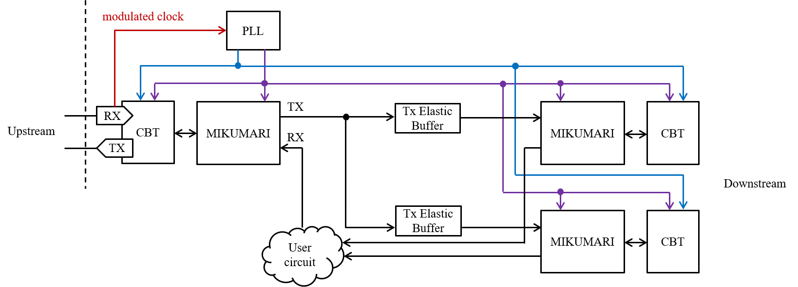

# MIKUMARI

The MIKUMARI is a clock signal, timing, and synchronous command distribution protocol for front-end electronics (FEE) based on the [clock-duty-cycle-modulation (CDCM)](https://ieeexplore.ieee.org/document/9131833). By distributing a modulated clock signal based on pulse width modulation (PWM), it is possible to transmit both clock signal and data on a single transmission line while achieving clock recovery without the clock-data-recovery (CDR) circuit. The MIKUMARI consists of the CDCM based transceiver (CBT) and the link layer protocol, the MIKUMARI link. The CBT provides the functionalities of the physical layer, and the MIKUMARI link defines the communication protocol between physically connected link end points.

The MIKUMARI is vender IP independent except for the serializer/de-serializer block in the CBT. Currently, the CBT is implemented for AMD Xilinx FPGAs using the IOSERDES primitive.

## Overview

The minimum configuration of the MIKUMARI is shown in the [figure](#MIKUMARI-MIN-CONFIG). The left and right hand sides are the primary and the secondary, respectively. The purpose of the MIKUMARI is distributing the reference clock signal to all the FEEs, and then a primary module may have an oscillator. To operate the system, two skew adjusted clock signals are necessary. One is the parallel clock signal to drive the parallel data path, and the other is the serial clock signal to drive the transmission line. In many cases, the reference clock will be equal to the parallel clock. The frequency ratio between the serial and parallel clock signals is defined by the modulation pattern. If the CDCM-10-XX (See [Ref](https://ieeexplore.ieee.org/document/9131833).) is used, the developer has to prepare the 5 times faster serial clock signal than that of the parallel clock, and 4 times faster clock signal is necessary for CDCM-8-XX. The maximum transferable reference (parallel) clock frequency is determined by the maximum acceptable clock signal frequency of the clock buffer in FPGA or the maximum data rate of IO pads. For example for Kintex-7 with the speed-grate -1 and the FBG package, the maximum BUFG speed and the maximum IO rate are 625 MHz and 1250 Mbps (HP bank case), and then the maximum transferable parallel clock speed is 125 MHz with CDCM-10-XX.

In the secondary side, these clock signals are reproduced from the modulated clock signal by a PLL on FEEs. Many PLL devices, i.e., PLLs in FPGA, external PLL ICs, and external jitter cleaner ICs, will work as a clock recovery circuit. To obtain the good jitter performance, the PLL of which the phase noise is low should be selected. The jitter distribution depends on the selected PLL device. As discussed in [Ref](https://ieeexplore.ieee.org/document/10098185), the obtained jitter rms when using MMCM in Kintex-7 FPGA is worse than that of the external jitter cleaner IC, CDCE62002. This comes not from the main peak structure but from the tail structure mainly. In author's opinion, MMCM is enough for 1 ns TDC synchronization, but it is not enough for high-resolution TDC with the precision around 30 ps. From the view point of the clock phase uncertainty, the PLL should have a zero-delay mode. As the CDCM technique recovers the parallel clock from the modulated clock, the phase uncertainty of the recovered clock does not appear if the PLL has the zero-delay mode. This is the important difference between the CDR circuit, which reproduced the serial clock. Unavoidable phase uncertainty exists due to the frequency division.

{: #MIKUMARI-MIN-CONFIG width="95%"}

Since the MIKUMARI system aims to distribute the reference clock signal to synchronize FEEs, the connection topology of the MIKUMARI link should be a tree structure starting from a primary module. If the primary module cannot drive all FEEs, a fan-out module is necessary in intermediate layers. An example of fan-out is shown in the [figure](#MIKUMARI-FANOUT). As the CBT and the MIKUMARI link are defined as the full-duplex transceiver and the link protocol for point-to-point communication, respectively, a simple signal fan-out is not allowed. In fan-out module, the clock signals are once recovered and drive the CBTs transferring the modulated clock signal to downstream modules. In many applications, all FEEs will receive the same command from the primary module, and then TX data can be broadcasted, however, a user circuit summarizing information from the downstream modules may be necessary in the RX side. However, this is not mandatory. Since the TX and RX of the MIKUMARI link are independent, the RX port of the right side can be left open if you decide not to use the uplink data path. Since the validOutRx and frameLastOutRx signals are one-shot, the RX port and the TX ports cannot be directly connected due to the txAck cycle. Therefore, the TxElasticBuffer is necessary to connect the RX and TX ports. The TxElasticBuffer is a simple queuing buffer for adjusting CBT character transfer cycle.

{: #MIKUMARI-FANOUT width="90%"}

The MIKUMARI link does not have a routing function, and then it does not support the end-to-end (source to destination) communication. Therefore, the clock signal, timing, and synchronous data transmissions are realized by repeating the point-to-point communication in the link layer. Thus, arbitrariness exists in the connection scheme inside the fan-out module. The MIKUMARI link protocol does not include experimental specific functions. It just provides the functionalities for sending a one-shot pulse with the fixed latency and the normal data transmission using the frame structure. An upper layer protocol, which provides dedicated functions for each experiment, is additionally necessary when using this system in actual experiments.

## MikumariBlock

The MikumariBlock is a wrapper module including the CbtLane and the MikumariLane. The intermediate signals between the CBT and the MIKUMARI link are hidden. For users, the author recommends to use the MikumariBlock. The almost all MikumariBlock entity ports are directly connected to the CBT and the MikumariLane entity ports. The reset input to the MikumariBlock is asynchronous.
