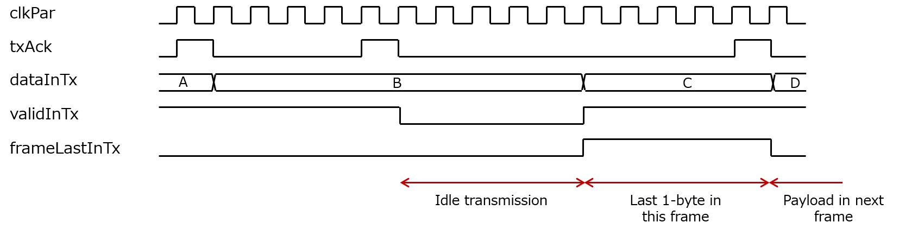
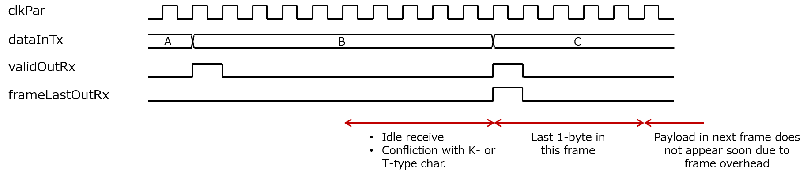
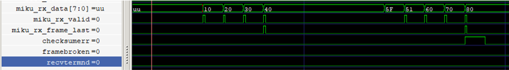
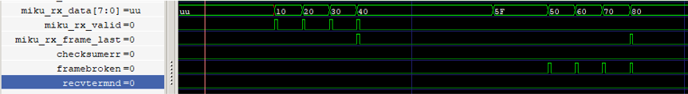
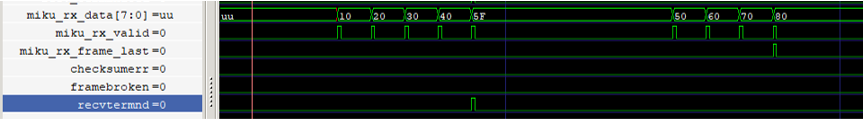

## MIKUMARI link protocol

The MIKUMARI link is a link layer protocol to establish the communication link between two end points, which are physically connected. The roles of the MIKUMARI link are as follows.

- Define the K-type characters; these are characters for the link control.
- Define a frame structure, called the MIKUMARI frame, for the data transmission
- One-shot pulse transmission with fixed latency using K-type characters.

### Interface of MIKUAMRI link

The top-level block of the MIKUMARI link is **MikumariLane**. The global parameters for the MIKUMARI link are defined in ``defMikumari.vhd``. The MikumariLane's entity port structure is as follows.

```VHDL
entity MikumariLane is
  generic
  (
    -- CBT --
    kNumEncodeBits    : integer:= 2;
    -- MIKUMARI-Link --
    enScrambler       : boolean:= true;
    kHighPrecision    : boolean:= false;
    -- DEBUG --
    enDEBUG           : boolean:= false
  );
  port
  (
    -- SYSTEM port --------------------------------------------------------------------------
    srst        : in std_logic; -- Asynchronous assert, synchronous de-assert reset. (active high)
    clkPar      : in std_logic; -- From BUFG
    cbtUpIn     : in std_logic; -- Cbt lane up signal
    linkUp      : out std_logic; -- Mikumari link is up

    -- TX port ------------------------------------------------------------------------------
    -- Data I/F --
    dataInTx      : in CbtUDataType;       -- User data input.
    validInTx     : in std_logic;          -- Indicate dataIn is valid.
    frameLastInTx : in std_logic;          -- Indicate current dataIn is a last character in a normal frame.
    txAck         : out std_logic;         -- Acknowledge to validIn signal.

    pulseIn       : in std_logic;          -- Pulse input. Must be one-shot signal.
    pulseTypeTx   : in MikumariPulseType;  -- 3-bit short message to be sent with pulse.
    pulseRegTx    : in MikumariHpmRegType; -- 4-bit additional message transferred by the pulse
    busyPulseTx   : out std_logic;         -- Under transmission of previous pulse. If high, pulseIn is ignored.

    -- Cbt ports --
    isKtypeOut  : out std_logic;
    cbtDataOut  : out CbtUDataType;
    cbtValidOut : out std_logic;
    cbtTxAck    : in std_logic;
    cbtTxBeat   : in std_logic;

    -- RX port ------------------------------------------------------------------------------
    -- Data I/F --
    dataOutRx   : out CbtUDataType;        -- User data output.
    validOutRx  : out std_logic;           -- Indicate current dataOut is valid.
    frameLastRx : out std_logic;           -- Indicate current dataOut is the last data in a normal frame.
    checksumErr : out std_logic;           -- Check-sum error is happened in the present normal frame.
    frameBroken : out std_logic;           -- Frame start position is not correctly detected
    recvTermnd  : out std_logic;           -- Frame end position of the previsou frame is not correctly detected

    pulseOut    : out std_logic;           -- Reproduced one-shot pulse output.
    pulseTypeRx : out MikumariPulseType;   -- 3-bit short message accompanying the pulse.
    pulseRegRx  : out MikumariHpmRegType;  -- 4-bit additional message transferred by the pulse

    -- Cbt ports --
    isKtypeIn   : in std_logic; --
    cbtDataIn   : in CbtUDataType;
    cbtValidIn  : in std_logic

  );
end MikumariLane;
```

<table class="vmgr-table">
  <thead><tr>
    <th class="nowrap"><span class="mgr-10">Port </span></th>
    <th class="nowrap"><span class="mgr-10">In/Out</span></th>
    <th class="nowrap"><span class="mgr-10">Comment</span></th>
  </tr></thead>
  <tbody>
  <tr><td class="tcenter" colspan=4><b>Generic port</b></td></tr>
  <tr>
    <td>kNumEncodeBits</td>
    <td class="tcenter">-</td>
    <td>Payload size of the CDCM signal. Set 1 or 2. 1: CDCM-10-1.5. 2: CDCM-10-2.5. Set the same value given for the CBT.</td>
  </tr>
  <tr>
    <td>enScrambler</td>
    <td class="tcenter">-</td>
    <td>If it's true, data scrambler is enabled. Enabling the scrambler is recommended for the better jitter performance.</td>
  </tr>
  <tr>
    <td>kHighPrecision</td>
    <td class="tcenter">-</td>
    <td>If it's true, the high-precision mode of the MIKUMARI pulse transmission is enabled.</td>
  </tr>
  </tr>
    <td>enDebug</td>
    <td class="tcenter">-</td>
    <td>Enable preset mark_debug constraints. The debug core will be implemented.</td>
  </tr>
  <tr><td class="tcenter" colspan=4><b>IO port</b></td></tr>
  <tr>
    <td>srst</td>
    <td class="tcenter">In</td>
    <td>Asynchronous assert, synchronous de-assert reset. (active high) </td>
  </tr>
  <tr>
    <td>clkPar</td>
    <td class="tcenter">In</td>
    <td>Parallel clock input; it is the identical clock as for the CBT.</td>
  </tr>
  <tr>
    <td>cbtUpIn</td>
    <td class="tcenter">In</td>
    <td>cbtLaneUp signal from the CBT. Connect to the cbtLaneUp port directly.</td>
  </tr>
  <tr>
    <td>linkUp</td>
    <td class="tcenter">Out</td>
    <td>This goes high when the link connection is established. If this is high, access to the data I/F ports are valid.</td>
  </tr>
    <td>dataInTx</td>
    <td class="tcenter">In</td>
    <td>8-bit user data input, the frame payload.</td>
  </tr>
  <tr>
    <td>validInTx</td>
    <td class="tcenter">In</td>
    <td>It denotes that the current dataInTx is valid. It is the request for the MIKUMARI link to transmit it.</td>
  </tr>
  <tr>
    <td>frameLastInTx</td>
    <td class="tcenter">In</td>
    <td>This signal indicates that the current dataInTx is last 1-byte in this frame transmission cycle. If the MIKUMARI link detects this signal, the frame checksum and the frame-end K-type character (FEK) are inserted.</td>
  </tr>
  <tr>
    <td>txAck</td>
    <td class="tcenter">Out</td>
    <td>The acknowledge signal respect to validInTx. This goes high when the dataInTx is latched.</td>
  </tr>
  <tr>
    <td>pulseIn</td>
    <td class="tcenter">In</td>
    <td>One-shot pulse input, equal to the pulse transmission request. If the MIKUMARI link detects this signal when the busyPulseTx is low, the pulse K-type character is inserted. Pulse transmission request has higher priority than the validInTX. <b>Pulse width must be one-shot, 1 clock cycle.</b></td>
  </tr>
  <tr>
    <td>pulseTypeTx</td>
    <td class="tcenter">In</td>
    <td>Pulse type input. This type value is transmitted together with a one-shot pulse. Currently, the pulse type width is 3-bit, and the 8-types of pulses can be transferred. The type value is latch when the pulseIn is high.</td>
  </tr>
  <tr>
    <td>pulseRegTx</td>
    <td class="tcenter">In</td>
    <td>The 4-bit extra data to be transmitted together with a one-shot pulse. This port is active only with the high-precision mode. The value is latch when the pulseIn is high.</td>
  </tr>
  <tr>
    <td>busyPulseTx</td>
    <td class="tcenter">Out</td>
    <td>Busy signal for pulse transmission. When it is high, the pulseIn input is ignored.</td>
  </tr>
  <tr>
    <td>isKtypeOut</td>
    <td class="tcenter">Out</td>
    <td>It indicates that the current cbtDataOut is a K-type character. Connect to isKtypeTx of the CbtLane.</td>
  </tr>
  <tr>
    <td>cbtDataOut</td>
    <td class="tcenter">Out</td>
    <td>8-bit data for the CBT. Connect to dataInTx of the CbtLane.</td>
  </tr>
  <tr>
    <td>cbtValidOut</td>
    <td class="tcenter">Out</td>
    <td>It indicates that the current cbtDataOut is valid. Connect to validInTx of the CbtLane.</td>
  </tr>
  <tr>
    <td>cbtTxAck</td>
    <td class="tcenter">In</td>
    <td>Acknowledge from the CBT respect to cbtValidOut. Connect to txAck of the CbtLane.</td>
  </tr>
  <tr>
    <td>cbtTxBeat</td>
    <td class="tcenter">In</td>
    <td>The boundary of the CBT character transfer cycle. Connect to txBeat of the CbtLane.</td>
  </tr>
  <tr>
    <td>dataOutRx</td>
    <td class="tcenter">Out</td>
    <td>8-bit user data output, received frame payload.</td>
  </tr>
  <tr>
    <td>validOutRx</td>
    <td class="tcenter">Out</td>
    <td>Data valid. If this is high, the current dataOutRx is valid.</td>
  </tr>
  <tr>
    <td>frameLastRx</td>
    <td class="tcenter">Out</td>
    <td>This goes high when the current dataOutRx is last 1-byte of the received frame payload.</td>
  </tr>
  <tr>
    <td>checksumErr</td>
    <td class="tcenter">Out</td>
    <td>If it is high, the checksum miss match is happened in the present MIKUMARI frame.</td>
  </tr>
  <tr>
    <td>frameBroken</td>
    <td class="tcenter">Out</td>
    <td>This signal goes high if the frame data body is received without detecting FSK. This indicates the communication error.</td>
  </tr>
  <tr>
    <td>recvTermnd</td>
    <td class="tcenter">Out</td>
    <td>This signal goes high if FSK is received without detecting FEK. It means that some communication troubles happen during the previous frame receive. </td>
  </tr>
  <tr>
    <td>pulseOut</td>
    <td class="tcenter">Out</td>
    <td>Received one-shot pulse output.</td>
  </tr>
  <tr>
    <td>pulseTypeRx</td>
    <td class="tcenter">Out</td>
    <td>Received pulse type value. The value when pulseOut is high is valid.</td>
  </tr>
  <tr>
    <td>pulseRegRx</td>
    <td class="tcenter">Out</td>
    <td>Received extra 4-bit data value. The value when pulseOut is high is valid.</td>
  </tr>
  <tr>
    <td>isKtypeIn</td>
    <td class="tcenter">In</td>
    <td>It indicates that the current dataOutRx is a K-type character. Connect to isKTypeRx of the CbtLane.</td>
  </tr>
  <tr>
    <td>cbtDataIn</td>
    <td class="tcenter">In</td>
    <td>8-bit data from the CBT. Connect to dataOutRx of the CbtLane.</td>
  </tr>
  <tr>
    <td>cbtValidIn</td>
    <td class="tcenter">In</td>
    <td>It indicates that the current cbtDataIn is valid. Connect to validOutRx of the CbtLane.</td>
  </tr>
</tbody>
</table>

### MIKUMARI frame and data transmission

The MIKUMARI protocol transmits the data using a simple frame structure, called the MIKUMARI frame. The frame consists of four blocks as follows.

- Frame start K-type character (FSK)
- Arbitral length data body (payload)
- 8-bit checksum
- Frame end K-type character (FEK)

The frame structure is similar that of [Xilinx Aurora 8b/1b](https://japan.xilinx.com/products/intellectual-property/aurora8b10b.html) protocol. Inserting FSK, FEK, and checksum are done by the MIKUMARI link, and later two are inserted after detecting frameLastInTx. At the receiver side, frameLastOutRx assertion and checksum calculation are performed after detecting the FEK. **Note that 8-bit checksum data does not appear from dataOutRx. It is internally used.** About details of the frame structure, see also [Ref](https://ieeexplore.ieee.org/document/10098185).

Since the frame body and 8-bit checksum data are D-type character, their transmission request can be blocked by the T-type character transmission by the CBT. If it is blocked, the txAck is not returned at the expected timing, the upper layer protocol needs to keep the current dataInTx and validInTx until txAck is returned. It is defined that pulse K-type characters have higher priority to other K-type character in this protocol. Thus, FSK and FEK insertion can be delayed by pulse transmission request. Therefore, the data transmission latency using the MIKUMARI frame is not perfectly fixed. Use the pulse transfer function for usages where arrival times must be strictly controlled.

The data interface of the MIKUMARI link is also similar to that of [Xilinx Aurora 8b/1b](https://japan.xilinx.com/products/intellectual-property/aurora8b10b.html) protocol (AXI4-stream). As there is the CBT character transmission cycle, txAck signal is used instead of tready signal.

The time chart for MIKUMARI data transmission is shown in the [figure](#MIKU-TX-TIME). The upper layer protocol sets the next data after detecting txAck high. If the data is last 1-byte of the frame body, assert frameLastInTx and keep it high until the next txAck high. The data 'D' is the 1st 1-byte of the data body in the next frame. We can suspend the data transmission by de-asserting validInTx. If validInTx is low at the txBeat timing, idle character is sent.

{: #MIKU-TX-TIME width="100%"}

The time char for MIKUMARI data receive is shown in the [figure](#MIKU-RX-TIME). The validOutRx goes high when the dataOutRx is valid. If the dataOutRx is the last 1-byte of the frame, frameLastOutRx goes high at the same timing of validOutRx. After that, as checksum and K-type character receive continues, user data in the next frame will not appear immediately. Sometimes, validOutRx will not go high at the expected timing due to idle character receive or conflicting with K- or T-type characters.

{: #MIKU-RX-TIME width="100%"}

### Pulse transmission

From version 2.0, the MIKUMARI-link protocol supports the high-precision mode for the pulse transmission. The original mode is called the low-latency mode to distingush them.

**Low-latency mode**

The pulse transmission with pulse types is realized by using K-type characters. The pulse type and the transmission request timing are encoded to a K-type character, and it is transmitted with highest priority. The receiver side decodes the received pulse K-type character and reproduces the pulse timing and the pulse type value. While the CBT character transmission is accepted once per 5 or 10 clock cycles, the pulse transmission can be requested at any timing. Due to the internal process realizing this feature, an additional idle character transmission is necessary after the pulse K-type character transmission. Therefore, the busy length for a pulse transfer is 10 and 20 clock cycles for CDCM-10-2.5 (CDCM-8-2.5) and CDCM-10-1.5 (CDCM-8-1.5), respectively. This limits the maximum pulse frequency. In addition, transmission of several pulse types at the same timing is also impossible.

Due to the limitation of the range of expressible bit combinations using 8-bit, the pulse K-type characters do not guarantee the DC balance of the signal on the transmission line. If the averaged duty ratio of the CDCM modulated clock is not 50%, the recovered clock signal phase is systematically shifted depending on the averaged duty ratio. This effect is visible when the pulse transfer rate is high. See [Ref](https://ieeexplore.ieee.org/document/10098185) for the details.

**High-precision mode**

The 3-bit pulse type and the 4-bit extra data are encoded to **two K-type characters.** Thus, the pulse trasmission takes longer pulse transmission latency and the busy time than thoese of the low-latency mode. For the same reason, the miximu pulse transmission rate is also decreased.
Instead, the high-precision mode ensures the DC balance perfectly. The phase shift of the recovered clock signal seen in the low-latency mode will not happen. This mode provides the better clock signal synchronization.

The author expects to use the extra 4-bit data to send information for the finer timing comepensation. For example, you can implement the 1-ns 3-bit TDC measuring the input pulse timing in the primary side (clkPar frequency is expected to be 125 MHz), and the TDC value is sent to the secondary side. Thus, you achieve the 1-ns timing trasmission.

### Data scrambler

The MIKUMARI link supports the data scrambling based on PRBS16. Since the data scrambler guarantees the DC balance on average and there is no demerit, the author strongly recommend to use it.

### Checksum error

The checksumErr goes high, if the received checksum value and the calculated value is not the same. The MIKUMARI link do nothing even if the checksum error is detected. When the error is detected, error handring is left to the upper layer protocol. This signal indicates that the communication error for D-type characters happens.
If the checksum error happens, the checksumErr signal goes high at the same timing of the frameLastRX signal as shown in the [figure](#CHECKSUM-ERR).

{: #CHECKSUM-ERR width="100%"}

### Frame broken

The data frame of the MIKUMARI-link protocol is defined as the D-type characters sandwitched by FSK and FEK.
The frame broken signal goes high, if the D-type characters are received without detecting FSK.
Since the frame starting position is unknown, all the data in this frame are invalid.
The frame broken signal goes high instead of the validOutRx signal as shown in the [figure](#frame-broken).

{: #FRAME-BROKEN width="100%"}

### Receive terminated

The recvTernd signal represents taht the frame receive process is terminated.
This signal goes high if the FSK is received without detecting the FEK for the previous frame as shown in the [figure](#RECV-TERM).
Since the frame end position of the 1st frame in the [figure](#RECV-TERM), the frame receive is terminated and it restarts immediately.
Then, the 2nd frame in the [figure](#RECV-TERM) is valid.

{: #RECV-TERM width="100%"}
